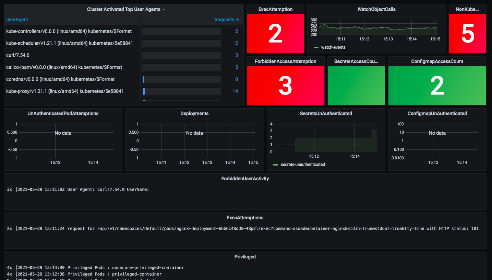
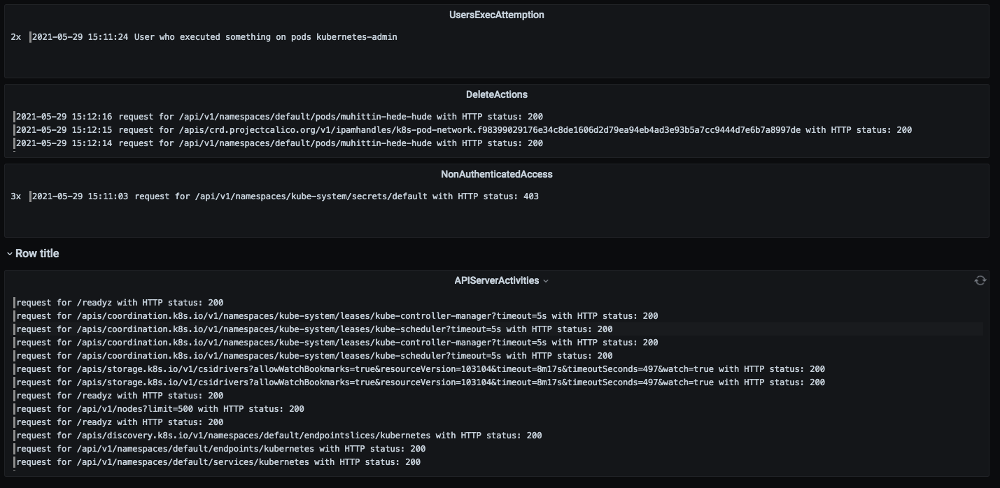

# KUBERNETES AUDIT DASHBOARD
This dashboard is parsing logs in Loki instance which is storing logs produced by promtail from your master instances in kubernetes clusters.
Dashboard presenting;
* privileged pods
* exec attemption
* forbidden access
* user activity
* watch action count
* user details (like request headers)
* non-kubectl access

You can enable audit policy under the `k8s` directory and locate promtail into your masters.

### Dashboard Views
</img>

</img>

